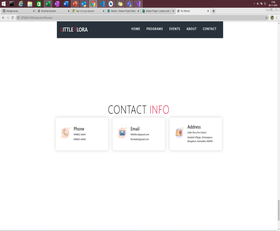

# 2009MYSSPSB1_WebProject_LittleFlora
A simple new application created in android studio using newsapi.org(for country news), alphavantage.co(for currency conversion), openweathermap.org(for weather report).
Features:-
1.News sort by country
2.Good UI
3.News In brief
4.Weather report by location
5.Dynamic currency exchange rates
6.Used Retrofit Network
# Hello :wave:
Welcome to **All in One** Project. It is a general perpous app. 
It uses many APIs to display information. It shows country specific new, weather of current location, movies rating, currency exchange rate, and memes 
## Technology/ Stack used :mortar_board:
- Java 
- XML
- Android Studio
- Retrofit

## Screenshots :LittleFlora :

|                        Main menu                     |                          Events                       |
| :--------------------------------------------------: | :---------------------------------------------------: |
|          |         |       |

|                    Contact Us                        |                   Popup_Msg                           |
| :--------------------------------------------------: | :---------------------------------------------------: |
|       |          |
 

## Features:
&nbsp;&nbsp;&nbsp;&nbsp;&nbsp;1.Country specific news in brief 
&nbsp;&nbsp;&nbsp;&nbsp;&nbsp;2.Weather report by location 
&nbsp;&nbsp;&nbsp;&nbsp;&nbsp;3.Dynamic currency exchange rate 
&nbsp;&nbsp;&nbsp;&nbsp;&nbsp;4.Reddit memes 
&nbsp;&nbsp;&nbsp;&nbsp;&nbsp;5.Search movies by name 
&nbsp;&nbsp;&nbsp;&nbsp;&nbsp;6.Movies release date and imdb rating 

## APIs Used :
&nbsp;&nbsp;&nbsp;&nbsp;&nbsp;1.**News :-** https://newsapi.org/v2/ 
&nbsp;&nbsp;&nbsp;&nbsp;&nbsp;2.**Weather :-** http://api.openweathermap.org/data/2.5/ 
&nbsp;&nbsp;&nbsp;&nbsp;&nbsp;3.**Meme :-** https://meme-api.herokuapp.com/ 
&nbsp;&nbsp;&nbsp;&nbsp;&nbsp;4.**Movies :-** https://api.themoviedb.org/3/ 
&nbsp;&nbsp;&nbsp;&nbsp;&nbsp;5.**Currency Exchange :-** https://www.alphavantage.co/ 
